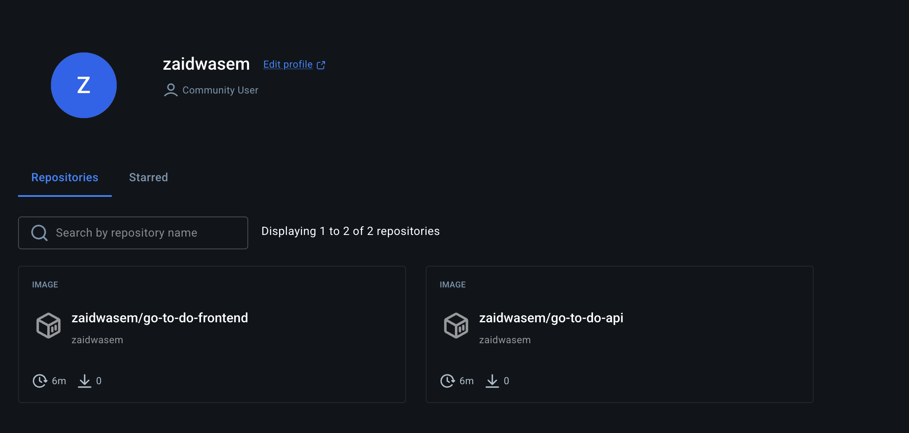
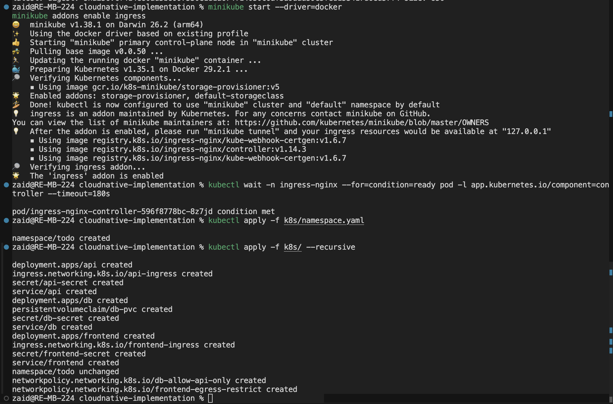

# Go To Do App — cloud-native assessment

I forked the upstream to-do app (Go API, React UI, MongoDB) for a Kubernetes deployment assignment: [github.com/zaidwaseem557-netizen/cloudnative-implementation](https://github.com/zaidwaseem557-netizen/cloudnative-implementation).

The stack is still Mongo + Go API + React static assets behind nginx. On top of that I added GitHub Actions pushing to Docker Hub, YAML under `k8s/`, Terraform that drives Minikube and applies those files, and NetworkPolicies for the bonus. Compose and Helm/Helmfile from the original fork are untouched if someone wants the old path.

---

## What I added

**CI** — Two workflows: [api-ci.yml](.github/workflows/api-ci.yml) on `server/**`, [frontend-ci.yml](.github/workflows/frontend-ci.yml) on `client/**`. Both target the `release` Dockerfile stage. Pushes to `main` / `master` log in with `DOCKERHUB_USERNAME` and `DOCKERHUB_TOKEN` and push `zaidwasem/go-to-do-api` and `zaidwasem/go-to-do-frontend` (`latest` + git SHA). PRs only build, no push.



**Kubernetes** — Namespace `todo`, Bitnami Mongo + PVC, API deployment with secrets for `DB_CONNECTION` / `DB_NAME`, frontend with the init container that generates `env.js` from `REACT_APP_*`. Ingress: `todo.local` (UI), `todo-api.local` (API); the React bundle uses `http://todo-api.local`.

Recursive `kubectl apply -f k8s` tried to create workloads before the namespace existed, so I always run `namespace.yaml` first, then recurse:

```bash
kubectl apply -f k8s/namespace.yaml
kubectl apply -f k8s/ --recursive
```



**NetworkPolicy** — Mongo only accepts 27017 from pods labeled `app: api`. Frontend egress is pinned to the API service + DNS. Whether that enforces on Minikube depends on the CNI.

**Terraform** — [terraform/](terraform/): `minikube start`, ingress addon, wait for ingress-nginx, apply manifests (namespace first), wait on pods, print an `/etc/hosts` reminder. Destroy tears down namespace `todo` and the script also stops Minikube on destroy, which is fine for a lab cluster but annoying if I were sharing that Minikube with other stuff.

The noisy full terminal output is in [TERMINAL_COMMANDS_LOG.md](TERMINAL_COMMANDS_LOG.md).

---

## Minikube

```bash
minikube start --driver=docker
minikube addons enable ingress
kubectl wait -n ingress-nginx --for=condition=ready pod -l app.kubernetes.io/component=controller --timeout=180s

kubectl apply -f k8s/namespace.yaml
kubectl apply -f k8s/ --recursive
```

I ran `minikube tunnel` in a second window and pointed `todo.local` / `todo-api.local` at `127.0.0.1` in `/etc/hosts`. Opened http://todo.local and hit the API at http://todo-api.local/healthz .

Terraform one-liner I used when I wanted the scripted path:

```bash
cd terraform && terraform init && terraform apply
```

---

## Secrets in the repo

The Mongo user/password in `k8s/db/secret.yaml` and `k8s/api/secret.yaml` are demo values for local cluster use, same idea as the sample `.env`. I wouldn’t ship that to prod; for Atlas I’d inject a secret locally and never commit the URI.

---

## Upstream

The fork already shipped docker-compose (`make up`, localhost 8081 / 8080) and Helmfile flows (`make k8s.up`, hosts like `todo.docker.internal`) — see [helmfile.yaml](helmfile.yaml), [helmfile.ecosystem.yaml](helmfile.ecosystem.yaml). Original writeup link: [desktop k8s / ingress notes](https://github.com/kubernetes-tn/guideline-kubernetes-enterprise/blob/master/general/desktop-env-setup.md).

---

## Contributing, authors, license

[CONTRIBUTING.md](CONTRIBUTING.md). MIT and author credits are still the upstream ones; my changes are the CI/k8s/terraform bits above.
